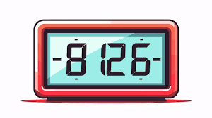

  

## Introduction 
Effort estimation is the process of predicting the amount of time it will take to complete a full-stack web application or portion of the application. Accurate software estimation is a rare and highly sought-after skill in the industry. Incorporating estimations within the full-stack application, allowed me to practice this skill and as a gauge to test my ability to predict application tasks. These predictions allowed the organization of the application to run smoothly, by understanding around how much time I would need for tasks.   
 
## Estimations
The effort estimations were predicted based on the individual task and incorporated extra time for debugging. Much of the tasks for the full-stack web application were practiced over the course of months with workouts of the day (WOD). The WODs within themselves are a timed exercise used to quickly and accurately complete a specific coding task, which promotes high coding repetitions to build muscle memory. Due to the similarities between the WODs and the web application, there was an overlap that allowed me to predict the application task by the closeness of the WODs attempted. The basis of the predictions were from the time it took me to complete the WODs. As not every feature applied in the application was performed during the WODs, the effort estimation was increased to compensate for learning and trying a task for the first time.      

Due to effort estimations being a new skill, most of the completion times were not close to the predicted time spent on the application tasks. Even though the time was inaccurate, the effort estimation allowed me to gauge how much time I would need to complete the application. This allowed for better planning due to knowing that a particular task will take a certain amount of time, allowing the work to be completed with ample amount of time to fix the code if issues arise.   

## Tracking Efforts
I found the tracking of effort estimation was found to be invaluable due to the fact that I could organize and plan pieces of the web application. Manual time tracking presented a challenge. While utilizing a digital clock was a good starting point, it was proven to be a challenge to distinguish between coding and non-coding efforts. A simple task, such as setting up the database, I didn't have any issue in the WOD, but during the application design it took longer to set up due to unforeseen errors. Due to the lack of experience with the errors in the database, I had to spend extra time debugging which was not accounted for in my initial prediction. In this case, it made me reanalyze the initial prediction moving forward in the application. Additional time was added to compensate for the unknown issues that may arise that I don't have experience with. It gave me the sense of realization that just because a task was easily completed the first time doesn't mean that the second will be as easy.    

There are definitely more accurate ways to track the time spent on the application than the practice I used. I just used a standard digital clock, which shows the time on the menu bar of my computer. While I thought this would be an easy way to track the amount of time spent, it made it difficult to accurately determine the time spent on coding and non-coding efforts. For this reason, I believe that my divided tracking time was somewhat accurate. The total completion time between coding and non-coding efforts is more accurate than the individual tasks.     

## Reflection
To improve my skill in effort estimation and tracking process I can choose a better time tracker and portion out the different tasks better. WakaTime is an extension in VS Code that allows you to track the time spent programming, which would allow me to receive an accurate time for the amount of time spent coding. A time, such as the Google timer, could be implemented to accurately receive the non-coding effort time. Pairing the two, I then could receive an accurate total amount of time spent on an individual task. Upon competing tasks, I would often implement new tasks that I know would have to be completed at a future time. This meant that I would finish an estimated task, then proceed to complete other tasks that aren't listed. So, I was completing additional tasks that should be separated. As effort estimation is a new task for me, my findings will allow me to have better predictions and tracking in the future.     
  

