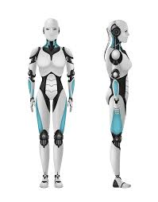

## Introduction
Over the course of the semester, I learned valuable topics and material related to software engineering. The course relied heavily on athletic programming which is a timed exercise to complete a series of programming tasks within. Throughout the semester, the course covered material such as coding standards, functional programming, and user interface designs. The software engineering course utilized web application development to explore important computer engineering topics. By drawing connections to other applications of software engineering, I gained a deeper understanding of the material, allowing what I have learned to be applied across different softwares. Allowing what I have learned to be applied to any application of software engineering. This paper will reflect and summarize the material I learned about software engineering and the meaning beyond web application design.  

## Coding Standards
Coding standards are used in any programming language that appears in any software engineering and computer science work. The understanding of how your work should be structured is a common practice that any programmer should possess. Coding standards are the blueprint of how code should be structured so it is readable, maintainable, and clean. The standard is imperative to all programmers due to its ability to allow anyone to read any type of code and understand the code. The standard that was practiced throughout the semester was ESLint. ESLint is a code analysis tool that implements coding standard enforcement, best practices, and style. This allowed the code submitted to be uniform across any assignment that needed to be completed. While the focus of this course is web application development, coding standards will appear and be a common practice within any form of coding. The standards for each application may differ, but overall will serve the same purpose. As the semester moved into the final group project, the coding standards became vital. This allowed the group to work on different tasks with the code appearing uniform. Ultimately, allowing the project to look seamless. Coding standards are the blueprint for writing code to allow programmers to design projects in groups, updating code, and reviewing all code not only applied to software engineering, but all programming.   

## Functional Programming
A new practice that was explored within the software engineering course was functional programming. Functional programming is a programming paradigm that utilizes the functions for creating reusable code. It fits perfectly into the software engineering course due to the effect on code efficiency and reusability. The application of using pure functions makes code easier to understand, test, and debug. Pure functions are functions that will return the same output with specific input. When practicing functional programming during the semester, I was tasked with using functions to sort an array of data without the use of for or while loops. I had to utilize the map, filter, and or sort methods to find solutions for functions. Allowing the functions to be used in multiple solutions rather than having a single application. The idea of functional programming does not only exist within web application development, but reaches all coding applications. Functional programming has a large presence in the financial and data processing sectors. The functionality allows these fields to create precise calculations using a mathematical approach. Functional programming was a unique way to explore software engineering solutions that can be applied across multiple applications to provide reusable solutions.

## Conclusion
Software engineering has taught me valuable applications that expand beyond web application development. While the focus for this semester was structured for web application development, I am now equipped with the proper knowledge to utilize these skills across all coding applications. A goal of software engineers is to provide reusable code that is efficient, simple, and understandable. Practicing coding standards allowed me to write code that is easily readable and pairs well with working in group projects. The application of functional programming has equipped me with the skills to be able to write efficient and reusable code that can be applied in multiple settings, rather than just one. I was able to test my learnings through athletic programming to be fast and efficient with the work that I was providing. Overall, the teachings can be used within any application of software engineering.  