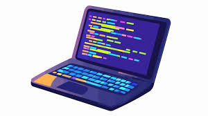

## Introduction
Software engineering has much more to offer than just coding; it is a discipline that utilizes engineering solutions to develop software.  While enhancing my software development skills, I learned about valuable topics and material related to software engineering. I practiced developing my skills through athletic programming, which focuses on high repetitions to quickly produce quality results under pressure. This practice covered material such as coding standards and functional programming. I practiced my software engineering skills using web application development to explore important computer engineering topics. By drawing connections to other applications of software engineering, I gained a deeper understanding of the purpose, demonstrating that these core principles are universal in software applications. The following sections will explore the knowledge I gained about software engineering and the meaning beyond web application design.

## Coding Standards
Coding standards are used in any programming language that appears in any software engineering and computer science work. The understanding of how your work should be structured is a common practice that any programmer should possess. Coding standards are the blueprint of how code should be structured so it is readable, maintainable, and clean. The standard is imperative to all programmers due to its ability to allow anyone to read any type of code and understand the code. In order to implement these standards, I utilized ESLint, a code analysis tool that implements coding standard enforcement, best practices, and style. The uniformity ensures that, while working in a team, the codebase remains understandable. While I practiced my skills in web application development, coding standards will appear and be a common practice within any form of coding. The standards for each application may differ, but overall will serve the same purpose. Testing out my skills in a team project, the coding standards became vital. This uniformly allowed the modules of the project to merge seamlessly. Coding standards are the blueprint for writing code to allow programmers to design projects in groups, updating code, and reviewing all code not only applied to software engineering, but all disciplines. 

## Functional Programming
A significant practice that was explored in my software engineering experience was functional programming. Functional programming is a programming paradigm that utilizes the functions for creating reusable code. It fits perfectly into the software engineering discipline due to the effect on making code efficient and reusable. The application of pure functions makes code easier to understand, test, and debug. Pure functions are functions that will return the same output with specific input. Through practice with functional paradigms, I gained experience in not applying logic such as “for” or “while” loops in functions. I utilized the applications of higher-order functions such as map, filter, and or sort methods to find solutions, allowing the functions to be used in multiple solutions rather than having a single application. The idea of functional programming does not only exist within web application development, but reaches all coding applications. Functional programming has a large presence in the financial and data processing sectors due to its predictability and lack of side effects. The functionality allows these fields to create precise calculations using a mathematical approach. Functional programming was a unique way to explore software engineering solutions that can be applied across multiple applications to provide reusable solutions.

## Conclusion
Software engineering has taught me valuable applications that expand beyond web application development. While my educational focus was structured for web application development, I am now equipped with the proper knowledge to utilize these skills across all coding applications. A goal of software engineers is to provide reusable code that is efficient, simple, and understandable. Practicing coding standards allowed me to write code that is easily readable and pairs well with working in group projects. The application of functional programming has equipped me with the skills to be able to write efficient and reusable code that can be applied in multiple settings, rather than just one. I was able to test my learnings through athletic programming to be fast and efficient with the work that I was providing, demonstrating that my knowledge can be used within any application of software engineering.  