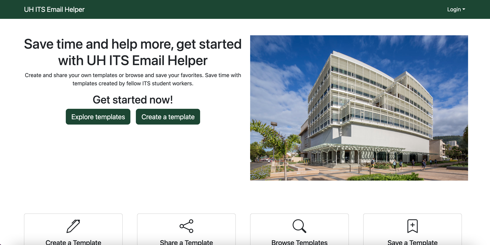

  
  

## Project Overview
The application was designed to help the University of Hawaii's Information Technology Services (ITS) department. Since student employees are limited to working a twenty-hour work week, the application was implemented to improve the efficiency of student workers. The UH ITS Email Helper application is a tool used by the student workers that features email templates for different issues the ITS department receives. The database provides users the ability to use and post their own templates for others to use. Due to the similarity in response emails, UH workers now have the ability to store and reuse templates to increase their productivity within their limited weekly hours.   

## Technical Implementation
The application is built on full-stack architecture covering the front-end user experience and back-end logic. 

* **Framework:** The application is built with Next.js, which allowed management in a single codebase.
* **Deployment:** The application is hosted on Vercel, which handles the deployment process automatically. 
* **Database Management:** The database is handled by PostgreSQL, allowing the storage of users and email templates to be organized. 
* **Administrative Tool:** pgAdmin is utilized as the tool to interact with the database, allowing for quick access to check, add, and edit the tables.    

## My Contributions
My primary contributions to the project focused on UI design, database management, and administrative functionality.

* **Page Design:** I developed the Admin, Edit, and Recently Used pages of the application. The Edit page allows users or administrators to modify templates; users may only edit their own posted templates, while administrators have access to all templates.
* **Administrative Features:** I implemented the functions that grant administrators oversight of the application. Admins have the power to edit or delete templates and can delete users if actions violate the application policies. 
* **User Experience:** I developed the Recently Used feature, which tracks and displays templates that a user has previously copied. This allows users to maintain the templates for quick access for common responses. 
* **Database Logic:** I managed the database for both the templates and the user profiles. A key function I implemented was a usage tracker to count how many times a template was used, which is tied to the "Copy" button. To ensure data integrity, the counter increments when a unique user copies a specific template for the first time, preventing the counter from becoming inflated due to repetitive clicking.     

***
[View Project Site](https://uh-its-email-helper.vercel.app/)