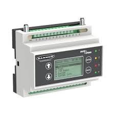
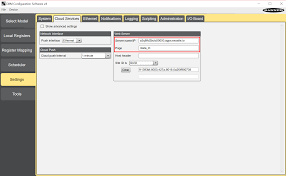

  
  

## Project Overview
The purpose of this project was to automate the irrigation system for watering crops. The team wanted to make watering crops more efficient by creating a system that would allow the water schedule to be monitored over the phone or computer rather than manually checking. A new system would allow the team to track the moisture in the ground, track weather, and check the pressure just by checking their mobile device. 
The central valves are another key area the automation has a focus on. This would allow the central valves to be opened and closed remotely. Reducing the need for employees to have to come into work over the weekend to shut off valves if there is a break or water leaking. The system will simplify the irrigation process and allow crops to get the correct amount of water needed. 

## Technical Implementation
The project involved setting up a gateway and binding Banner Engineering's wireless controllers to the gateway. The wireless controller would need to be programed inside of Banner's DXM software and pairing that with Ignition Perspective. The wireless controller could also be used as a repeater to cover all areas of the farm. Once the boxes were programmed and bound, they could be deployed out into the field. This project is still ongoing and about half of the boxes have been deployed. 

## My Contributions
My contributions to the project involved programming the Banner Engineering DXM controllers to the gateway. This involved doing range testing to determine where the repeaters on the farm needed to set up to achieve the best possible connection. Once the repeaters were established, I was tasked with deploying the boxes to the water sources to then begin testing the controller. I was able to learn how to program and establish a functional connection within a network of wireless controllers.   
