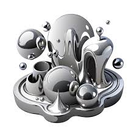

  

The Liquid Metal VIP team was responsible for studing reflective intelligent surfaces(RIS). The RIS is used to reflect radio waves, in short terms. The idea behind the project is that radio was could be redirected around obsticles that would hinder your devices recieving a signal. This means that in dead zones a signal can be recieved. 

For this project, I was responsible for designing a reflectivie intelligent surface and testing the surface. The design process included cutting a stencil and using a spray gun to spray liquid metal, gallium, onto a substrate. The testing would begin with using a copper plater, an emitter would send a signal at the plate and a reciver would pick up the reflected signal. The copper plate would allow us to recieve a baseline of what a perfect RIS would act like. The RIS created would be tested and compared with the copper plate. 
