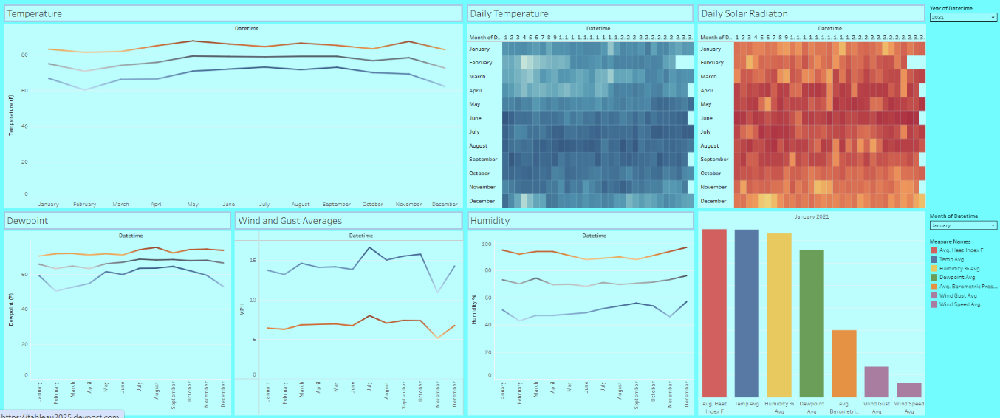
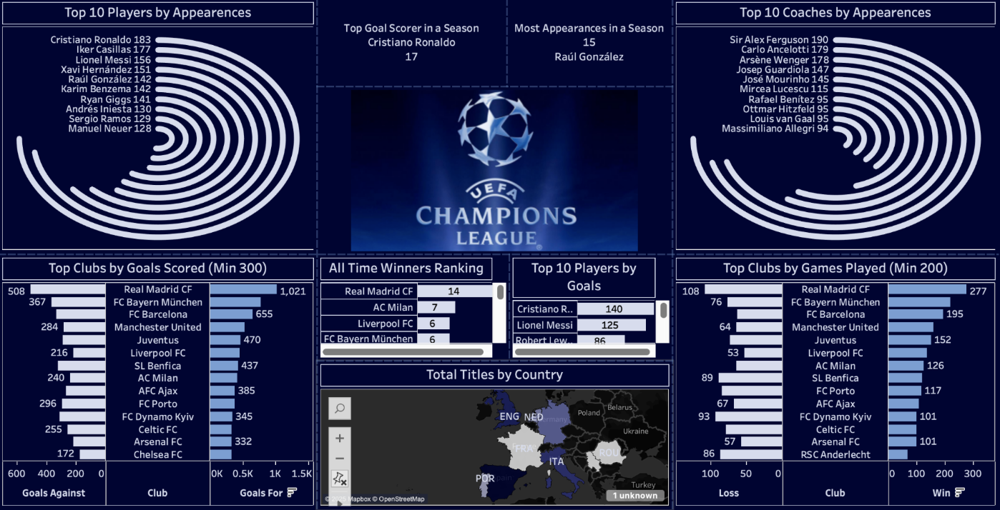

  
  

The University of Hawaii wants to achieve net-zero energy by the year 2030. In order to help reach this goal, the Smart Campus Energy Lab tracks and predicts weather patterns. This allows the university to understand the peaks and troughs with energy consumption. The university can compare the weather data with the energy consumption data to see if weather and energy consumption have an correlation with each other. Allowing the unniversity to effectivly create a plan to become a net-zero energy campus.   

For this project, I was assigned to the Dashboard team whose responsibility was to use data visualization tools to design a dashboard that displays weather data. The two primary tools used included Grafana and Tableau. Grafana was used as a live data tracking dashboard that connects into the gateway. Tableau was designed to create a historical dashbaord that tracks the previous five years. This would allow to track the weather patterns to see if the weather was consistent.  
