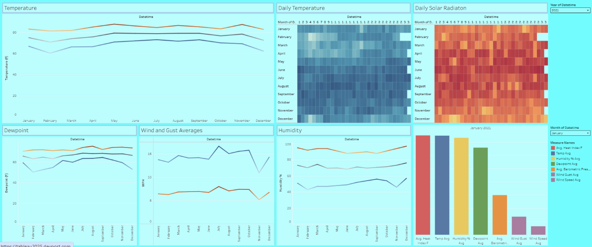
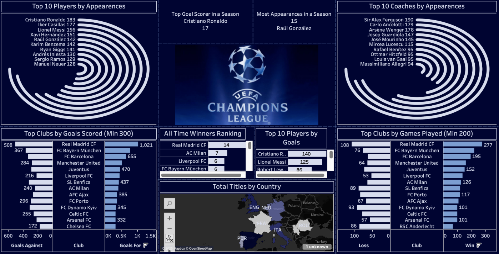

  
  

## Project Overview
The University of Hawaii wants to achieve net-zero energy by the year 2035. In order to help reach this goal, the Smart Campus Energy Lab tracks and predicts weather patterns. This allows the university to understand the peaks and troughs with energy consumption. The university can compare the weather data with the energy consumption data to see if weather and energy consumption have a correlation with each other, allowing the university to effectively create a plan to become a net-zero energy campus.   

## Technical Implementation
For this project, I was assigned to the Dashboard team whose responsibility was to use data visualization tools to design a dashboard that displays weather data. The two primary tools used included Grafana and Tableau. Grafana was used as a live data tracking dashboard that connects into the gateway. Tableau and Python dashboards are designed to create a historical dashboard that tracks the previous five years. This allowed us to track the weather patterns to see if the weather was consistent. 

## My Contributions
My contributions to the project involved designing a real-time dashboard and a historical dashboard to display the weather data that is collected around campus. I designed the real-time dashboard in Grafana, which pulls the data straight from the database. I designed the historical dashboard on Python due to displaying the past five years of weather data. I gained the knowledge on how to proficiently use multiple data visualization tools to effectively show weather data and the importance of data visualization.